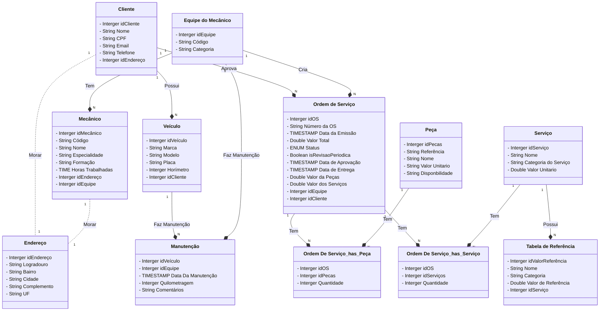

# Diagramas De EER 
O repositório possui diagrama de Entidade Relacionamento Estendido no contexto de oficina de carro, seguindo os seguintes requisitos:

  - Sistema de controle e gerenciamento de execução de ordens de serviço em uma oficina mecânica
  - Clientes levam veículos à oficina mecânica para serem consertados ou para passarem por revisões periódicas
  - Cada veículo é designado a uma equipe de mecânicos que identifica os serviços a serem executados e preenche uma OS com data de entrega.
  - A partir da OS, calcula-se o valor de cada serviço, consultando-se uma tabela de referência de mão-de-obra
  - O valor de cada peça também irá compor a OS cliente autoriza a execução dos serviços
  - A mesma equipe avalia e executa os serviços
  - Os mecânicos possuem código, nome, endereço e especialidade
  - Cada OS possui: n°, data de emissão, um valor, status e uma data para conclusão dos trabalhos.

## Diagrama da Oficina

## Contribuir
 - Se você deseja contribuir para o projeto, siga estes passos:

    1. Faça um fork do repositório.
    2. Crie uma branch para suas modificações: `git checkout -b minha-contribuicao`.
    3. Faça as modificações e commit: `git commit -m "Minha contribuição: Descrição"`.
    4. Envie as modificações para o seu fork: `git push origin minha-contribuicao`.
    5. Abra um pull request para revisão.

 - Colocar estrelas ⭐

## Autor

<table>
  <tr>
    <td align="center"><a href="https://github.com/samuelfilho-dev"> <strong>Samuel Filho</strong></a> <a href="https://www.linkedin.com/in/samuelfilho-dev/">LinkedIn</a></td>
  </tr>
</table>